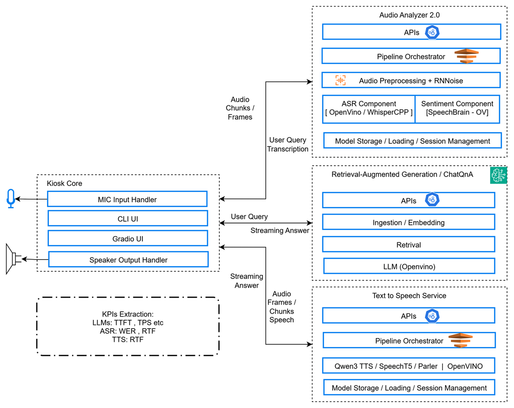

# How It Works

This page describes the architecture and the internal flow of a single
voice request through Smart Kiosk Assistant.

## Architecture

Smart Kiosk Assistant runs as five cooperating services on a single host.
The browser captures microphone audio and uploads it to `kiosk-core`, which
orchestrates speech-to-text, retrieval-augmented answer generation, and
speech synthesis through three model-hosting microservices.

## Components

- `kiosk-ui` — Gradio interface. Captures microphone audio via the Web
  Audio API and posts it to `kiosk-core`. Polls the session endpoint
  until answer text and generated audio are available, then plays the
  audio clips back in order.
- `kiosk-core` — FastAPI session orchestrator. Owns the per-session
  state machine, forwards audio to `audio-analyzer`, sends the
  transcription to `rag-service`, and streams the generated answer
  sentence-by-sentence to `text-to-speech`.
- `audio-analyzer` — OpenAI-compatible speech-to-text microservice
  built on Whisper and OpenVINO.
- `rag-service` — Local retrieval-augmented generation microservice
  hosting a Qwen LLM, a BGE embedding model, and a BGE reranker, all
  on OpenVINO.
- `text-to-speech` — OpenVINO TTS microservice supporting SpeechT5 and
  Qwen-TTS.

`kiosk-core` and `kiosk-ui` host no models. All inference happens
inside the three model-hosting services.

## Request Flow

1. **Capture** — The browser records a microphone utterance and uploads
   it to `kiosk-core` as a WAV file along with session parameters.
2. **Session start** — `kiosk-core` creates a session, returns the
   `session_id` immediately, and runs the rest of the pipeline in the
   background. The UI polls
   `GET /api/v1/sessions/{session_id}` to track progress.
3. **Speech-to-text** — `kiosk-core` chunks the upload at silence
   boundaries and forwards each chunk to `audio-analyzer`. The combined
   transcript is appended to the session snapshot.
4. **Retrieval-augmented answer** — When the user has finished speaking
   (silence timeout or max-duration reached), `kiosk-core` sends the
   transcript and recent conversation history to `rag-service`.
   `rag-service`:
   - embeds the question with the BGE embedding model,
   - retrieves candidate chunks from Chroma,
   - optionally reranks them with the BGE cross-encoder,
   - prompts the Qwen LLM with the retrieved context, and
   - streams the answer back token-by-token.
5. **Speech synthesis** — As `kiosk-core` receives the answer stream, it
   splits the text into sentences and posts each sentence to
   `text-to-speech`. The generated WAV files are written to the shared
   `generated_audio/` volume and recorded in the session snapshot.
6. **Playback** — The browser UI sees new `tts_audio_segments` in the
   session snapshot, downloads them from `kiosk-core`, and plays them
   sequentially.

See the [Configuration](./get-started/configuration.md) guide for environment variables,
model selection, and per-service device fields.
